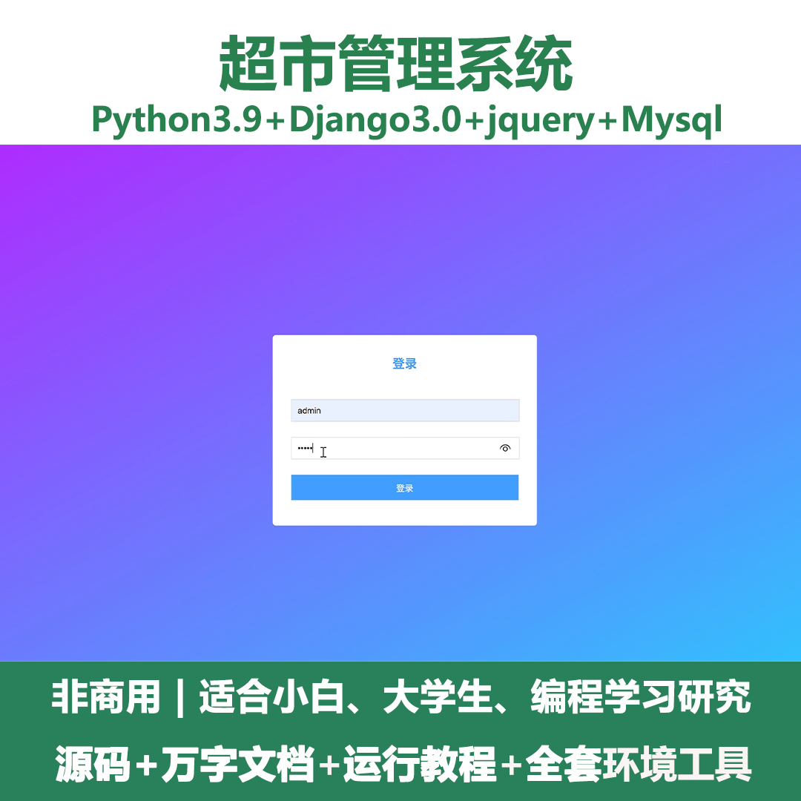
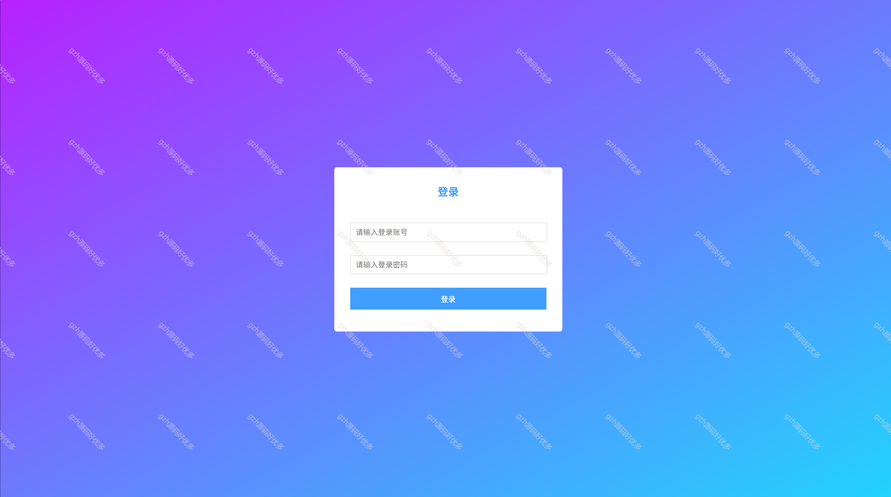
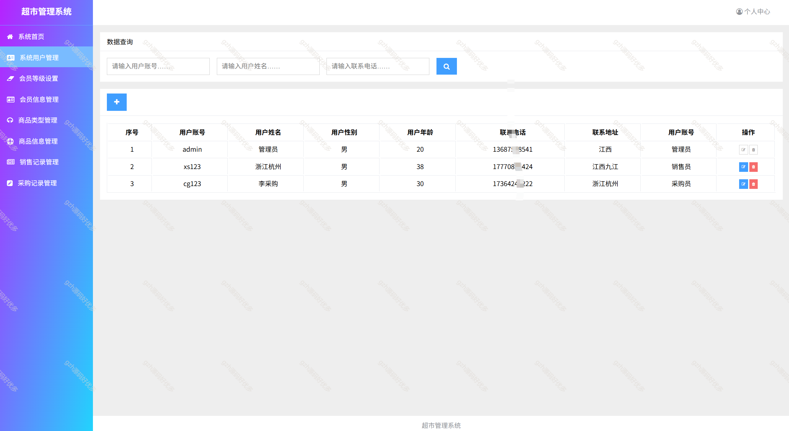
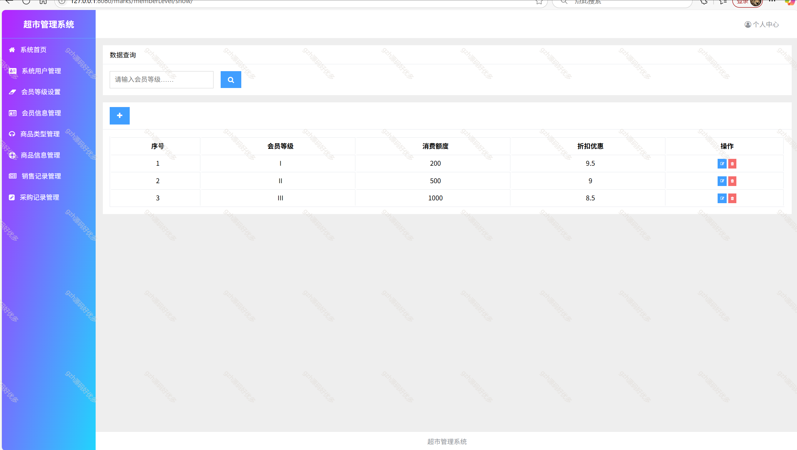
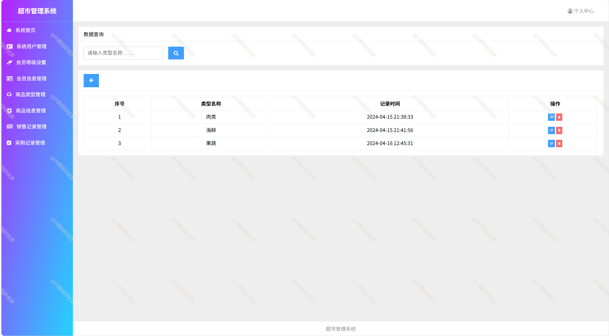
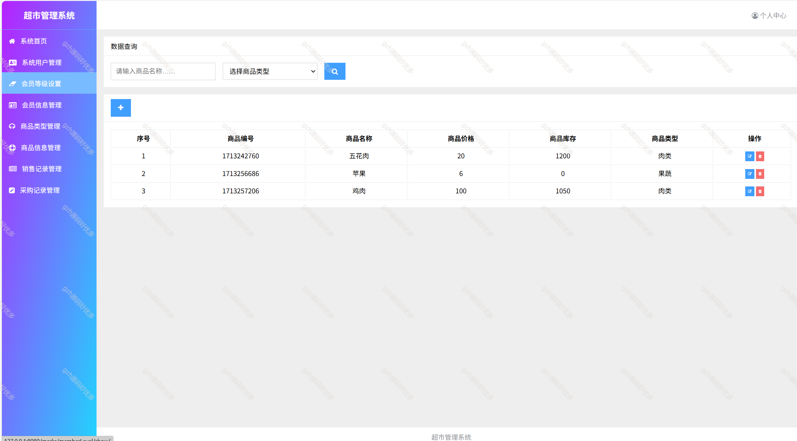
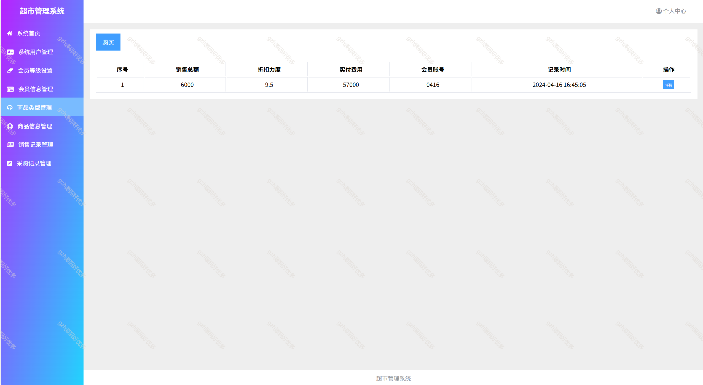
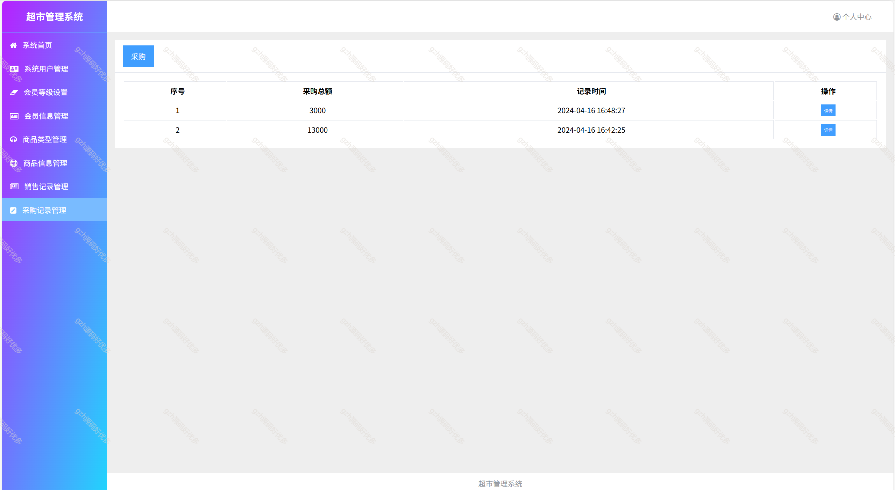
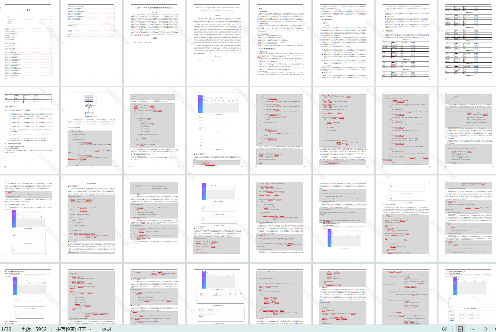

# python053
python053基于Python+Django的超市管理系统
 
## 查看主页获取源码

### 一、关键词
超市管理系统，超市系统

### 二、作品包含
源码+数据库+万字文档+全套环境和工具资源+本地部署教程

### 三、项目技术
前端技术：jQuery、html,css
后端技术：Python3.9、Django3.0

### 四、运行环境（以下版本亲测，其他版本兼容性请自行测试）
开发工具：PyCharm

数据库：MySQL8.0

数据库管理工具：Navicat10+

Python：Python3.9

浏览器：谷歌浏览器

### 五、项目介绍
项目编号：python053

随着人们生活水平的提升，日常消费水平也在逐渐提升，为了满足人们的生活需求，出现了越来越多的综合型的大型超市，这些为人们生活提供了便利，为了更好的管理超市，所以开发一套功能完善的管理系统是势在必行。

管理员登录管理，会员等级管理，会员信息管理，商品类型管理，商品信息管理，销售记录管理，采购记录管理，修改密码。
销售员登录销售商品记录，浏览商品，个人中心修改密码
采购员登录采购商品，浏览商品，

### 六、运行截图

